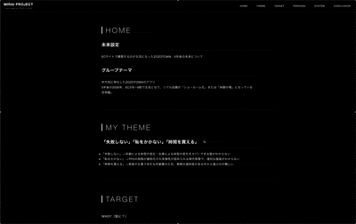

# MIRAI PROJECT — NEXT STAGE FOR ZOZO IN 2030

アートシンキングの授業で制作した、2030年のZOZOTOWNを想定した未来提案サイトです。

テーマは、

**「ECサイトでの購買が主流になった5年後のZOZOTOWN」**

です。

年代別に特化したZOZOTOWNの未来像を考えるグループ課題の中で、私は30〜59歳のミドル世代を対象としたサービスを企画しました。

---

## Preview

GitHub Pagesで公開しています。

[[https://hashio251.github.io/FUTURE-PROJECT-art-thinking-/](https://hashio251.github.io/01_website_performance-artthinking-/)](https://hashio251.github.io/01_website_presentation-artthinking-/)



---

## About

2030年にはECでの購買がさらに一般化し、リアル店舗は「商品を買う場所」から、ショールームや体験の場へ変化しているという未来を想定しました。

その中で、30〜59歳のミドル世代が抱える、

* 体型の変化
* TPOへの不安
* 服選びにかけられる時間の少なさ
* 家族全体の服の管理
* ファッションに対する予算管理

といった課題に注目しました。

若年層向けの「探す楽しさ」とは異なり、

**「選ばなくていい快適さ」**

を重視したEC体験を提案しています。

---

## Concept

この企画では、ミドル世代のファッションにおける課題を3つの軸で整理しました。

### 失敗しない

年齢やライフステージによる体型変化に合わせて、今の自分に似合う服を選べること。

### 恥をかかない

結婚式、仕事、学校行事など、TPOに合わせた適切な服装を選べること。

### 時間を買える

仕事・育児・介護などで忙しい世代が、服を探す・比較する・悩む時間を減らせること。

---

## Proposed Service

### ZOZO EDIT & FAMILY

人生の主役世代に、専属の「編集者」を。

無数の商品から自分で探し続けるのではなく、AIやデータを活用して必要な選択肢を絞り込むサービスを想定しています。

### Main Features

#### Style Fit Pro

スマートフォンによるスキャンを利用し、サイズだけでなく、体型や姿勢の変化も考慮して似合う服を提案します。

#### Smart Wardrobe

現在持っている服との組み合わせを確認し、購入後に「合わせる服がない」という失敗を減らします。

#### Scene Navigator

商品名ではなく、

* 仕事
* 結婚式
* 学校行事
* 家族イベント

などの利用シーンから服を探せる機能です。

#### Family Function

家族全員の服・サイズ・買い替えタイミングなどを一括で管理することを想定しています。

---

## Target

対象は30〜59歳のミドル世代です。

特に、

* 仕事や育児、介護などで自由な時間が少ない人
* 以前と体型が変化し、服選びに迷いを感じている人
* 年齢に合った服装とトレンドのバランスに悩んでいる人
* 家族全体の服を効率的に管理したい人

を想定しています。

---

## Website

このWebサイトは、授業発表時に企画内容を視覚的に伝えるために制作しました。

単純な資料ページではなく、Webサイトとして閲覧できる形にすることで、企画の世界観やサービスイメージをより具体的に伝えることを目的としています。

### Features

* 固定ナビゲーション
* セクション内リンク
* ターゲット・ペルソナ紹介
* サービス機能紹介
* UIモック画像の表示
* iframeを使用したアプリデモ
* レスポンシブデザイン

---

## Technologies

| Technology   | Usage               |
| ------------ | ------------------- |
| HTML5        | ページ構造               |
| CSS3         | レイアウト・デザイン・レスポンシブ対応 |
| iframe       | アプリデモ画面の埋め込み        |
| Git / GitHub | バージョン管理             |
| GitHub Pages | Webサイト公開            |

---

## Development

Webサイト制作では、最初に生成AIを利用してHTML・CSSなどの基本的な骨組みやテンプレートを作成しました。

その後、そのコードをベースとして自分で内容や構造を確認しながら、

* HTML構造の調整
* レイアウト変更
* 配色・余白・文字サイズの調整
* レスポンシブ対応
* 画像やモックの配置
* iframeを利用したスマートフォン画面表現
* CSSの修正
* 表示崩れのデバッグ

などを行っています。

`app.html`についても、生成AIによるベースコードを使用したうえで、発表内容に合わせてUIやウィンドウ表現などを調整しています。

生成AIは完成品をそのまま使用するのではなく、**サイト制作の骨組みや実装方法を考えるための補助ツール**として使用しています。

---

## Directory Structure

```text
FUTURE-PROJECT-art-thinking-/
├── index.html
├── app.html
├── README.md
│
├── assets/
│   ├── css/
│   │   └── style.css
│   │
│   └── images/
│       ├── persona/
│       ├── demo/
│       └── ...
│
└── mirai-project.gif
```

※ 実際のファイル構成に合わせて適宜変更してください。

---

## How to View

GitHub Pagesから閲覧できます。

https://hashio251.github.io/FUTURE-PROJECT-art-thinking-/

ローカル環境で確認する場合は、リポジトリをクローンまたはダウンロードし、`index.html`をブラウザで開いてください。

---

## Conclusion

この企画では、2030年のZOZOTOWNを単なるECサイトではなく、

**「ファッションを通して生活そのものを支援するサービス」**

として考えました。

服を買う場所から、

**生活を整えるパートナーへ。**

ミドル世代が服選びに費やす時間や不安を減らし、仕事や家庭、自分自身の時間に集中できる未来を目指した提案です。

---

## License

本プロジェクトは、授業・学習目的で制作した作品です。

掲載されている文章・画像・デザイン等の無断転載・再利用はご遠慮ください。

---

**Planning / Web Design / Development**
Yuka Hashio
